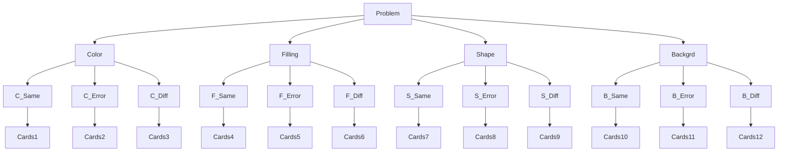

# MetaReasoning for Monte Carlo Tree Search (MCTS)

The diagram shows the structure of a SET problem of F43, a vector field in 4D with 3 terms on each dimension.
In terms of the card setting, a dimension can be called as attribute, and terms can be called as elements.

- **Task:**
Human/Artificial agents are given with five cards without any prior knowledge or explanation.
The task is to choose 3 cards that forms a triplet.
The only information available is that the answer must be 3 cards and the only feedback is binary reward (+1/0 for correct/incorrect).
The total trials are 90 and the feedback is removed after one (30 trials) or two blocks (60 trials) of the experiments.

### Structure of the problem

### State representation
- 4 x 4 grid

|Dims|Same| Err|Diff|
|----|----|----|----|
| C  |    |    |    |
| F  |    |    |    |
| S  |    |    |    |
| B  |    |    |    | 

### Files
1. **humanData.py**: 
>- Import a problem and answer from humans' behavioral data.
>- Change cards into digits (ex. [[0. 1. 2. 2.], [0. 2. 2. 2.], [0. 1. 2. 0.], [0. 0. 2. 1.], [1. 2. 2. 0.]])

2. **createGame.py**: 
>- Initialize a problem.
>- Map each problem structure to a grid by dimension (ex. [(0, 0, 0, 0, 1), (1, 2, 1, 0, 2), (2, 2, 2, 2, 2), (2, 2, 0, 1, 0)])
>- By elements (i.e., same / error / different)
>- Create leaf values by the number of cases of 5C3 at the end of each node. (ex. [[[ 4.  6.  0.], [ 0.  6.  4.], [10.  0.  0.], [ 0.  6.  4.]]))

3. **createNode.py**: 
>- Turn each (state) or (state, action) into nodes 
>- Nodes are memoryless; The node does not store contexts, but only place-holder-like states.
>- Properties: number of visits (self.N), values (self.Q), parent action (self.parentAction), and children.

4. **treeSearch.py**:
>- Hyperparam: exploration bonus (constant) C, and discount factor = 1.
>- Permanent properties: number of visits and Q values for the agent to learn between-trial knowledge.
>- Temporary properties: the state of a game trial, and UCB1. 

5. **main.py**:
>- Sets the max iterations and runs all.

6. **utils.py**:
>- Utils for visualization.